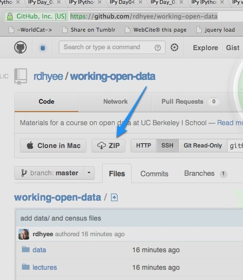

% Day 4: Getting started with pandas and NumPy II
% Raymond Yee 
% January 31, 2013 (<http://bit.ly/wwod1304>)

# Goals

# Better integration of iPython notebook with "regular" Python environments

[Importing or executing a notebook as a normal Python file](http://ipython.org/ipython-doc/dev/interactive/htmlnotebook.html#importing-or-executing-a-notebook-as-a-normal-python-file)

# You can download git repo as zip file

# import/naming conventions and pylab

<http://my.safaribooksonline.com/book/programming/python/9781449323592/1dot-preliminaries/id2699702>

    import numpy as np
    import pandas as pd
    import matplotlib.pyplot as plt
    
These imports done for you in `pylab` mode.

## pylab mode

    ipython --help
    
yields

    --pylab=<CaselessStrEnum> (InteractiveShellApp.pylab)
        Default: None
        Choices: ['tk', 'qt', 'wx', 'gtk', 'osx', 'inline', 'auto']
        Pre-load matplotlib and numpy for interactive use, selecting a particular
        matplotlib backend and loop integration.

# NumPy

<http://www.numpy.org/>:

NumPy is the **fundamental package for scientific computing with Python**. It contains among other things:

* a powerful N-dimensional array object [let's start with 1 and 2 dimensions]
* sophisticated (**broadcasting**) functions [what is *broadcasting*?]
* tools for integrating C/C++ and Fortran code [why useful?]
* useful linear algebra, Fourier transform, and random number capabilities

Besides its obvious scientific uses, NumPy can also be used as an efficient
multi-dimensional container of **generic data**. **Arbitrary data-types** can be
defined. This allows NumPy to seamlessly and speedily integrate with a wide
variety of databases.

# Homework